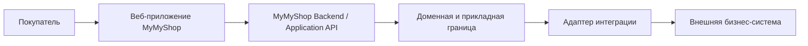

# Архитектура MyMyShop — SHOP-ARCH-01

Документ отражает состояние репозитория на коммите `8232dd5558aad6e6932960926e682bc1a2839903` (2026-10-08). **CURRENT** — подтверждено кодом; **PLANNED** — запланировано, но не реализовано; **PROPOSED** — архитектурное предложение, требующее отдельного решения; **OPTIONAL** — необязательная возможность без утверждённого решения. Упоминание домена или внешней системы не означает наличие развёрнутого backend, поставщика или интеграции.

Сейчас MyMyShop — статический демонстрационный магазин на React. Цель — интернет-магазин с серверной границей для операций и интеграций. Публичный demo должен честно показывать ограничения локальных данных, сессии и оформления заказа.

## Возможности: сейчас и в целевой системе

| Возможность | Текущая реализация | Целевая реализация | Влияние на frontend | Влияние на backend и интеграции | Статус |
| --- | --- | --- | --- | --- | --- |
| Каталог | Локальный снимок DummyJSON; дополнительный прямой режим API | API каталога и преобразование моделей | Убрать выбор источника из страниц за контракт | Владелец каталога; PIM необязателен | CURRENT / PLANNED |
| Сессия | Demo-идентичность только в памяти | Настоящая сессия и интерфейс входа | Сменить адаптер, обработать истечение и ошибки | Серверная проверка; поставщик идентификации необязателен | CURRENT / PLANNED |
| Аккаунт | Публичная demo-страница Profile | Обзор, профиль/аватар, адреса, настройки | Отдельные экраны и контракты | Владение данными покупателя | CURRENT demo / PLANNED |
| Корзина | Redux и версионированный `localStorage` | Серверная корзина и правила согласования | Сохранить действия, добавить сервисную границу | Домен корзины; внешняя система не обязательна | CURRENT / PLANNED |
| Оформление | Кнопка-заглушка пишет в console, показывает alert и очищает корзину; Order и Payment не создаются, данные заказа не сохраняются | Проверка доставки/самовывоза и создание заказа | Пошаговый сценарий | Сервер проверяет цену, наличие и заказ | CURRENT placeholder / PLANNED |
| Заказы | Нет | История, детали, отмена | Экраны Account/Orders | Домен заказов; OMS необязателен | PLANNED |
| Платежи | Нет | Инициация, статусы, возвраты | Статусы и при необходимости защищённый интерфейс поставщика | Серверный адаптер и PSP | PLANNED |
| Отгрузки | Только статическая страница о доставке | Статус и отслеживание | Отслеживание в деталях заказа | Домен исполнения; WMS/перевозчик необязательны | PLANNED |
| Отзывы | API-источник запрашивает `reviews`; в текущем локальном снимке данных отзывов нет. Полноценный пользовательский UI и отправка не реализованы | Отображение, отправка и жизненный цикл отзывов и оценок | PDP и отзывы/оценки в аккаунте | Домен отзывов; модерация необязательна | SOURCE DATA CURRENT / FEATURE PLANNED |
| Поддержка | Локальный ChatBot; форма контакта пишет в console | Обращения и переписка | Интерфейс поддержки | Домен поддержки; CRM/helpdesk необязателен | CURRENT demo / PLANNED |
| Уведомления | Отдельного сервиса нет | Уведомления о статусах | Настройки и сообщения | Домен уведомлений; поставщик необязателен | PLANNED |
| Аналитика | Отдельной интеграции нет | Согласованные события и наблюдаемость | Безопасная граница событий | Инструмент не выбран | OPTIONAL |

## Слои и границы

**CURRENT:** представление находится в `src/pages` и `src/shared`; состояние пользовательских функций и прикладная логика сосредоточены преимущественно в Redux и `src/features`. Существуют `sessionService → demoSessionAdapter`, адаптер версионированного хранения корзины в `localStorage` и RTK Query для DummyJSON. Разделение неполное: `ProductsPage` и `ProductDetailsPage` выбирают `?source=api` и непосредственно используют данные источника. Общего преобразователя DTO каталога нет. Backend и внутренние бизнес-системы не подключены.

**PLANNED — целевая граница:**

Интерфейс должен зависеть от контрактов функций и доменов, а не от конкретного источника данных, SDK поставщика, DTO внешней системы или demo-реализации адаптера. **PLANNED:** MyMyShop Backend / Application API отвечает за учётные данные, достоверные цены, заказы, платёжные статусы, права доступа и внешние интеграции. **PROPOSED:** явные сервисные и доменные границы не требуют отдельных процессов: первоначальный backend **может** быть модульным монолитом. Для микросервисов нет принятого решения или текущей потребности. Исключение для браузера возможно в виде защищённого платёжного интерфейса или перенаправления поставщика; намерением платежа, связью с заказом и проверкой статуса всё равно управляет backend.

## Статический demo и приложение с backend

**CURRENT:** React SPA пригодна для статического портфолио/demo-размещения; публикация на GitHub Pages ещё не подтверждена. Есть локальный снимок каталога (URL изображений остаются внешними), дополнительный публичный режим DummyJSON, Redux-корзина с версионированным хранением в `localStorage` и demo-сессия только в памяти через `sessionService → demoSessionAdapter`. Реального backend, учётных данных, внешних бизнес-интеграций, оформления заказа, сохранения Order, обработки Payment и исполнения заказа нет. Кнопка оформления — заглушка: console, alert и очистка корзины.

**PLANNED:** настоящие авторизация и сессия, Account, редактирование профиля/аватара, адреса, Orders и Order Details, Shipment Tracking, Checkout, Payments, Refunds и Support через MyMyShop Backend / Application API и серверные адаптеры интеграций. **PROPOSED:** явные сервисные/доменные контракты и преобразование DTO в модели интерфейса. Demo-адаптеры — детали реализации за контрактами. Будущий ticket отзывов должен проследить путь `данные источника → преобразование/нормализация → модель frontend/домена → представление на PDP`. Контракты, маршруты и схемы утверждаются в следующих tickets.

## Принципы и открытые решения

- **CURRENT — подтверждённые факты:** [архитектура frontend](FRONTEND_ARCHITECTURE.md) и [среды поставки](DELIVERY_AND_ENVIRONMENTS.md).
- **PLANNED — правило:** UI не интегрируется напрямую с CRM, ERP, WMS, backend API PSP и перевозчика. Изменяемое состояние браузера не является источником истины для чувствительных операций.
- **PROPOSED — правило:** при подключении backend использовать явные контракты функций и преобразование DTO; сохранять границы ответственности и в одном развёрнутом backend.
- **Открыто:** размещение backend, поставщики, схемы API, транспорт сессии, согласование корзины, способ оплаты, статусы заказа, сроки хранения данных и операционные цели. Решения принимаются в отдельных tickets реализации и безопасности.

Далее: [контекст системы](SYSTEM_CONTEXT.md), [домены](DOMAIN_MODEL.md), [бизнес-процессы](BUSINESS_FLOWS.md), [интеграции](INTEGRATIONS.md), [границы доверия](SECURITY_BOUNDARIES.md), [среды](DELIVERY_AND_ENVIRONMENTS.md) и [ADR](adr/README.md). [ROADMAP](../ROADMAP.md) определяет порядок реализации. Этот blueprint не закрывает implementation tickets.
