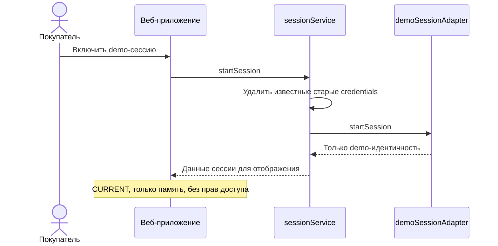
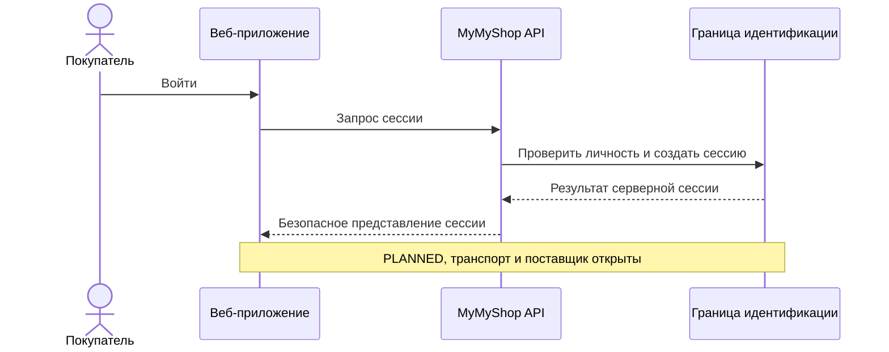
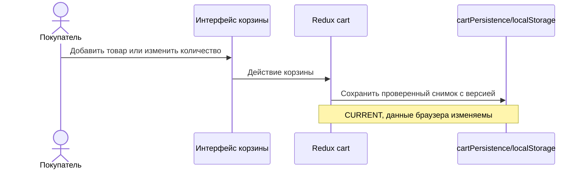
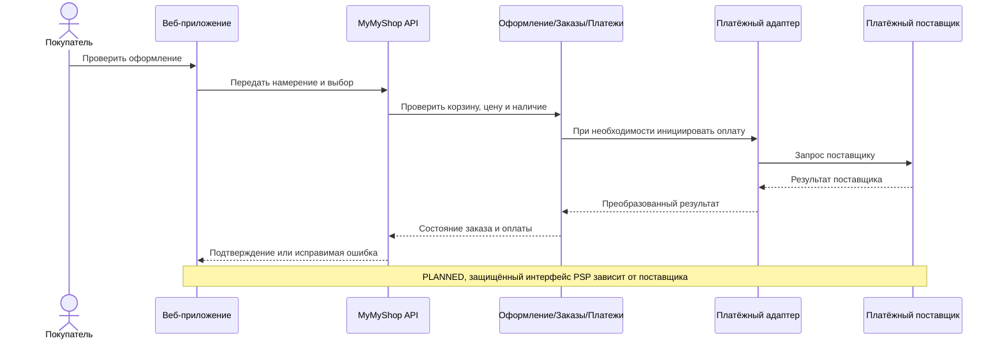
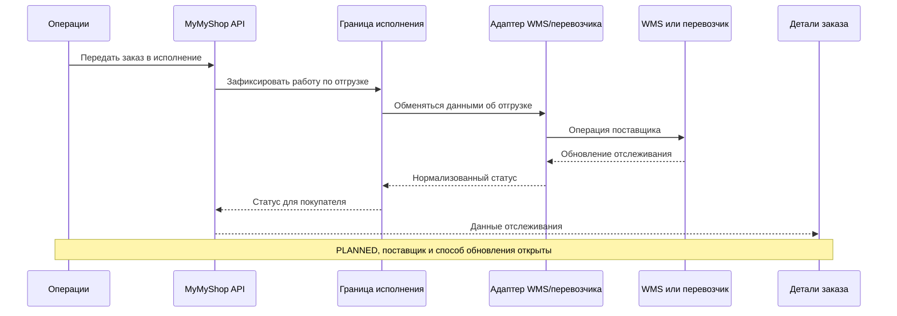
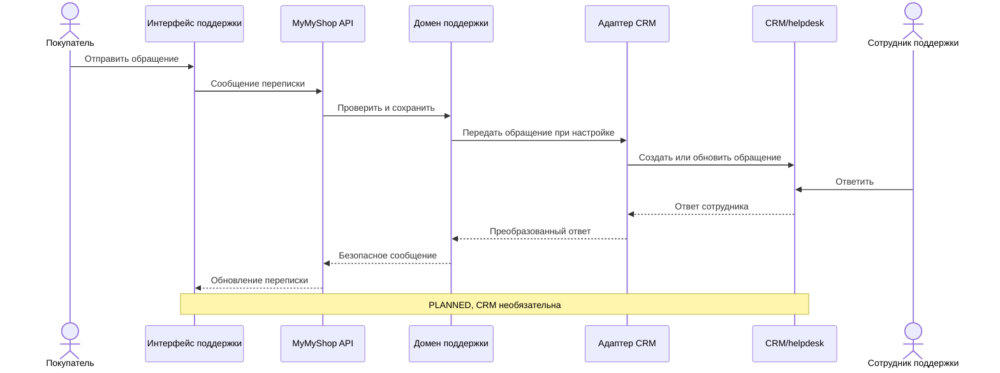
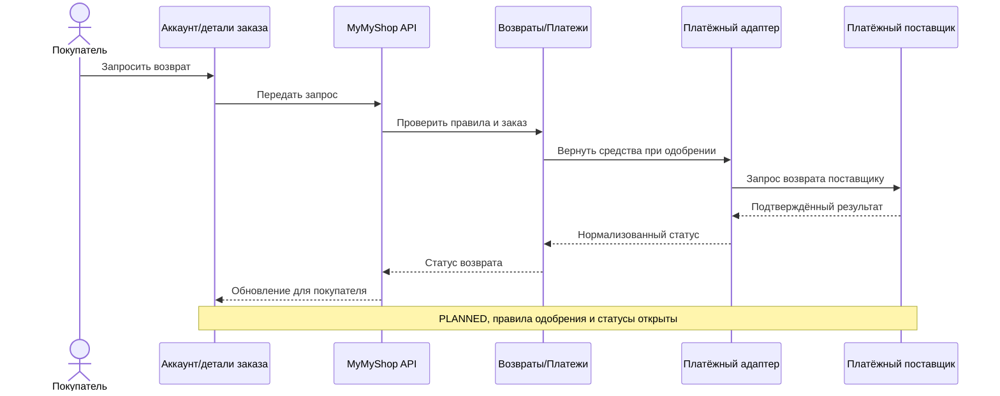

# Бизнес-процессы

Стрелки обозначают ответственность и порядок, а не утверждённые API или наборы статусов. Шаги **CURRENT** подтверждены в SPA; для **PLANNED** нужны отдельные implementation tickets. Если участвует внешняя система, путь проходит через `веб-приложение → MyMyShop Application API → доменная/прикладная граница → адаптер → внешняя система`.

## Выбор товара, корзина и сессия

| Процесс | CURRENT | Продолжение PLANNED / PROPOSED |
| --- | --- | --- |
| Поиск товара | Покупатель → каталог → локальный поиск/категории/фильтры/сортировка → PDP; дополнительный режим DummyJSON ограничен загруженными страницами | PLANNED API каталога и преобразование DTO; PIM OPTIONAL |
| Корзина | Товар → добавление/количество/удаление → Redux → версионированный `localStorage` | PLANNED серверная корзина Customer; правило объединения открыто |
| Сессия/аккаунт | Анонимный посетитель → demo-сессия в памяти → demo Profile; обновление страницы завершает сессию | PLANNED настоящая авторизация, истечение сессии, Account, редактирование Profile/аватара и настройки |
| Недавно просмотренные | Сервиса истории нет | PLANNED просмотр PDP → возможно, сначала локальная история; серверная синхронизация требует Customer-идентичности |

## Оформление и жизненный цикл заказа

**CURRENT:** кнопка CartPage пишет корзину и итог в console, показывает alert и очищает корзину. Order и Payment не создаются. Статическая DeliveryPage не выбирает доставку.

**PLANNED:** корзина → выбор доставки/самовывоза → серверная проверка цены, наличия и данных Customer → при необходимости инициация оплаты → создание и подтверждение заказа. Точный порядок и обработка отказов определяются контрактами заказов/платежей; следующая схема **PROPOSED**, а не спецификация API. Возможные состояния — создан, ожидает оплаты, авторизован/оплачен, исполняется, отправлен, доставлен, завершён. Окончательный набор и переходы утверждает ticket домена Orders. История и детали заказа должны показывать неизменяемые снимки OrderItem, статусы оплаты и отгрузки, отслеживание и отмену там, где её допускают правила.

**PLANNED — исполнение и отслеживание:** заказ → операции/исполнение → отгрузка → перевозчик при его использовании → обновление статусов через backend → детали заказа. Статус для покупателя должен опираться на серверные данные, а не создаваться браузером.

## Поддержка, отзывы и действия после покупки

**PLANNED — поддержка:** покупатель → интерфейс поддержки → MyMyShop Support API/домен → необязательный адаптер CRM/helpdesk → сотрудник поддержки. Ответ сотрудника возвращается через интеграционную и серверную границы в переписку/уведомление. **CURRENT** ChatBot отвечает локально по правилам: нет истории обращений, сотрудника или CRM. ContactPage пишет введённые данные в console. Будущие возможности: история, номер обращения, контекст заказа, причина, эскалация, непрочитанные сообщения, ответ сотрудника и уведомления; вложения **OPTIONAL**.

**PLANNED — отзыв/оценка:** Customer → купленный или просмотренный товар → отправка → домен Reviews → необязательная модерация → PDP и Account. Правила допуска, модерации и публикации открыты. Сейчас API-режим запрашивает поле `reviews`, но в локальном снимке его нет; базовый компонент PDP не является полноценной функцией отзывов. Отдельный ticket должен проверить путь от данных источника через нормализацию и модель до представления на PDP.

**PLANNED — возврат товара/денег:** запрос Customer → проверка условий в Orders/Returns → при одобрении серверный платёжный адаптер/PSP → необязательное обновление ERP → статус для покупателя. Правила возврата, разрешения, частичных сумм и сроков открыты.

**PLANNED — профиль и адреса:** Customer редактирует профиль/аватар или адреса в Account → Customer API/домен → серверная запись → необязательная передача в CRM. При оформлении используется выбранный адрес; изменение в браузере не подтверждает право владения. Хранение аватара, проверка ввода, сроки хранения и адрес по умолчанию определяются позднее.
