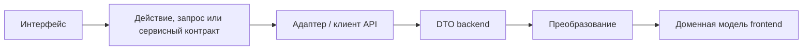

# Архитектура frontend

## CURRENT — устройство репозитория

- `src/main.jsx` подключает React, Redux Provider, BrowserRouter, глобальные стили и i18n. `src/app/App.jsx` задаёт маршруты; `MainLayout` окружает страницы магазина Header, Footer, локальным ChatBot и MobileNavigation. Login расположен вне этого layout. `/checkout` перенаправляет на `/cart`, `/register` — на login, `/admin` — на главную. Неизвестные маршруты показывают NotFound. Для ленивых страниц есть индикатор загрузки и граница ошибок отображения.
- `src/features` содержит auth, cart, products, sale, theme и language; `src/pages` собирает экраны; `src/shared` содержит общие компоненты. Это организация кода, а не полностью выделенный доменный слой.
- `src/app/store.js` настраивает Redux Toolkit и RTK Query `productsApi`. Сессия хранится в памяти; корзина загружается через `cartPersistence`, а изменения сохраняются подпиской на store. Тема и язык используют настройки браузера.
- `sessionService` обращается к `demoSessionAdapter`, выдаёт безопасную для отображения форму `{status, user}` и удаляет известные старые ключи credentials. Demo-вход не использует пароль, роли или защищённый доступ. Profile показывает только demo-идентичность.
- Основной каталог использует датированный локальный снимок. `?source=api` обращается непосредственно к DummyJSON через RTK Query для поиска, категорий и PDP. Локальный `catalogPipeline` выполняет поиск, фильтрацию и сортировку. В API-режиме доступны лишь загруженные страницы. `ProductImage` задаёт размер слота, загрузку и заглушку при ошибке. В текущем снимке 194 товаров нет поля `reviews`; API-запрос PDP запрашивает его, а в коде PDP есть базовый компонент `Reviews`. Полноценный пользовательский интерфейс отзывов и их отправка не реализованы.
- Строки корзины — снимки товара и цены в Redux, ссылки учитывают источник. `cartPersistence` проверяет и версионирует данные `localStorage`. CartPage и CartDrawer отображают корзину. Кнопка оформления в CartPage — заглушка с console, alert и очисткой корзины; она не создаёт и не сохраняет заказ или платёж. Проверки наличия, серверной синхронизации и достоверного расчёта заказа нет.
- Есть RU/EN i18n и переключение темы. Адаптивный интерфейс включает нижнюю мобильную навигацию. У каталога и ленивых страниц есть отдельные состояния загрузки/ошибки/пустой выдачи, но единой модели для всего приложения пока нет. Playwright проверяет каталог, корзину, сессию, изображения и навигацию; CI запускает проверки на Linux.

## PLANNED — поток данных frontend

Это направление для функций с backend, **не** утверждение о наличии преобразователей во всех текущих функциях. Контракт интерфейса должен позволить заменить demo-адаптер реальным HTTP-адаптером. RTK Query может остаться механизмом запросов и кеша. В браузере не должны находиться credentials внутренних бизнес-API. Правила загрузки и ошибок серверных операций определяются в следующих tickets.

**PLANNED — крупные продуктовые блоки, здесь не реализуются:** настоящий интерфейс авторизации; обзор Account; редактирование Customer Profile и аватара; Orders и Order Details; отслеживание отгрузки; адреса; полноценное отображение и отправка отзывов и оценок; недавно просмотренные товары; настройки; оформление; платежи; доставка/самовывоз; возвраты; поддержка. См. [домены](DOMAIN_MODEL.md) и [процессы](BUSINESS_FLOWS.md). Существующие Profile, Delivery, базовый компонент `Reviews` и ChatBot не равнозначны готовым возможностям.

**PLANNED — Account/Orders:** точные маршруты открыты (возможный вариант: `/account`, `/account/orders`, `/account/orders/:orderId`). Список заказов должен показывать номер, дату, статус, сумму и товары. Детали — коммерческий снимок позиций, расчёт цены, способ доставки и краткий адрес, статусы платежа/возврата и отгрузки, отслеживание, хронологию и действие для обращения в поддержку. Владение данными, доступ, пустые/ошибочные состояния и переходы статусов относятся к следующим tickets. Реальная авторизация также требует сценариев входа, регистрации/восстановления при утверждении, проверки ввода, загрузки и ошибок.
