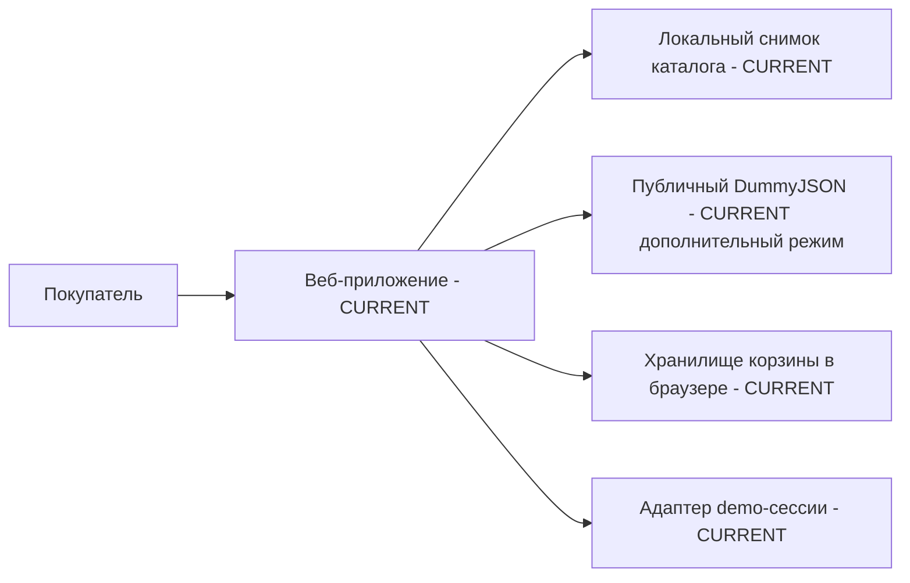
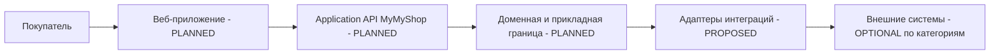

# Контекст системы и контейнеры

Значение статусов приведено в [обзоре архитектуры](ARCHITECTURE.md). Конкретные поставщики намеренно не указаны.

## Участники и граница системы

| Участник | Роль | Статус |
| --- | --- | --- |
| Покупатель | Просматривает каталог, управляет локальной корзиной и demo-сессией | CURRENT |
| Сотрудник поддержки | Работает с будущими обращениями и жалобами | PLANNED |
| Сотрудник операций/логистики | Управляет исполнением заказа и исключениями доставки | PLANNED |
| Сотрудник финансов/бухгалтерии | Сверяет платежи и возвраты | PLANNED |
| Администратор магазина/контент-менеджер | Управляет товарным содержимым | PLANNED |
| Разработчик/оператор | Разрабатывает, проверяет и сопровождает поставку | CURRENT для разработки и CI; эксплуатация production PLANNED |

**CURRENT:** веб-приложение MyMyShop — SPA в браузере. **PLANNED:** серверная граница MyMyShop Backend/Application API с прикладными и доменными обязанностями. Указанные далее категории внешних систем — возможные зависимости, а не действующие подключения.

**PLANNED — концептуальные области:** идентификация/сессия, покупатель/аккаунт, каталог, корзина, оформление, заказы, платежи/возвраты, исполнение/отгрузки, отзывы/оценки, поддержка, уведомления. Это границы ответственности, а не существующие backend-модули или микросервисы. Первоначальный backend может быть модульным монолитом. Дальнейшее разделение требует подтверждённой продуктовой или операционной потребности.

**OPTIONAL — категории внешних систем:** поставщик идентификации, CRM/helpdesk, PSP/эквайер, OMS/WMS, перевозчик, бухгалтерская система/ERP, поставщик уведомлений, PIM/CMS, аналитика/наблюдаемость и модерация отзывов. Категория может отсутствовать, быть внутренней системой или предоставляться будущим поставщиком. Для бизнес-операций веб-приложение обращается к MyMyShop API; ограниченное исключение для защищённого интерфейса платежного поставщика описано в [границах доверия](SECURITY_BOUNDARIES.md).

## Связь MyMyShop с реальной работой магазина

| Возможность для покупателя | Целевой домен MyMyShop | Бизнес-функция | Внешняя категория | Статус |
| --- | --- | --- | --- | --- |
| Содержимое товаров | Каталог | Мерчандайзинг/контент | PIM/CMS необязателен | PLANNED процесс; CURRENT demo-снимок |
| Оплаченный заказ | Заказы/платежи | Операции и финансы | PSP; OMS/ERP необязательны | PLANNED |
| Отслеживание | Исполнение | Логистика | WMS/перевозчик необязательны | PLANNED |
| Возврат денег | Возвраты | Поддержка и финансы | PSP; ERP необязателен | PLANNED |
| Жалоба покупателя | Поддержка | Служба поддержки | CRM/helpdesk необязателен | PLANNED |

Таблица описывает ответственность бизнеса, а не уже созданные команды, подключения или процессы.
